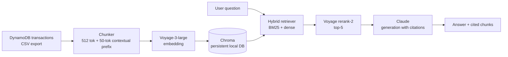

# finance-pipeline-rag

> RAG pipeline over a banking-history corpus — LangChain orchestration + Chroma vector store + Claude API generation. Hybrid retrieval (BM25 + dense embedding) following the Anthropic Contextual Retrieval pattern, with reranking and a DeepEval CI eval suite.

> **Corpus note:** the project ships with a **synthetic corpus** of ~500-1000 transactions, deterministically generated to exercise retrieval quality across 15-20 categories and 12 months. This is honest about scope — the predecessor [`finance-pipeline`](https://github.com/HarshPatel7x/finance-pipeline) ingests Plaid-sandbox data; real BofA `development`-mode OAuth was a known unresolved blocker. The retrieval + eval logic is corpus-agnostic — swap in real DynamoDB output once available without changing the pipeline.

> **Status:** WIP — Step 1 (repo skeleton) shipped 2026-05-27. Build steps tracked in [`plans/WORKITEMS.md` §#1](../plans/WORKITEMS.md). Hard ship date: **2026-06-02**.

---

## What this project defends (resume-verbatim claims)

This repo exists to be the working proof behind these lines on the AI resume — any of which a recruiter or screener may probe:

- **RAG pipeline over banking-history corpus:** LangChain orchestration + Chroma vector store + Claude API generation.
- **Hybrid retrieval** (BM25 keyword filter + dense semantic embedding) following the **Anthropic Contextual Retrieval** pattern — chunk-level contextual prefix added before embedding, then reranking on top-k candidates.
- **DeepEval test suite** — faithfulness, answer-relevancy, contextual-recall, and hallucination-rate metrics (DeepEval RAG-triad) — running on every commit via GitHub Actions CI/CD.
- **Targets:** hallucination rate <5%, faithfulness >0.85, contextual-recall@5 >0.85, p95 retrieval latency <200 ms.
- **Reusable eval harness** pluggable into downstream agent + MCP projects.

---

## Architecture



The pipeline embeds each transaction chunk with a contextual prefix (per the Anthropic 2024 pattern) so retrieval sees "context + content," not just content. At query time, BM25 catches exact merchant matches that dense retrieval misses; dense catches semantic matches BM25 misses; the union is reranked by Voyage rerank-2 and fed to Claude for citation-grounded generation.

---

## Metrics

| Metric | Target | Status | Measured at |
|---|---|---|---|
| Hallucination rate | <5% | **TARGET — not yet measured** | Step 6 (DeepEval harness) |
| Faithfulness | >0.85 | **TARGET — not yet measured** | Step 6 |
| Contextual recall @ 5 | >0.85 | **TARGET — not yet measured** | Step 6 |
| p95 retrieval latency | <200 ms | **TARGET — not yet measured** | Step 8 (latency profiling) |

**Honesty rule:** if a metric lands below target after measurement, this table will report the actual number + a one-line note on what would close the gap. No silent fudging.

---

## Stack + decisions

| Layer | Tool | Why this choice |
|---|---|---|
| Orchestration | LangChain | Standard RAG plumbing; matches AI-stack expectations |
| Embedding | Voyage-3-large | Anthropic-aligned embedding model; ~$1 to embed full corpus |
| Vector store | Chroma | Local persistent DB; appropriate for <10K-doc corpus, no infra cost |
| Reranker | Voyage rerank-2 | Same vendor as embed → single API integration; typically >5pp recall lift |
| Generation | Claude (Haiku dev / Sonnet eval) | Haiku for fast iteration; Sonnet for eval runs that need higher fidelity |
| Eval framework | DeepEval | RAG-triad metrics (faithfulness, recall, relevancy); industry-standard |
| Eval judge LLM | Ollama Llama-3.1-8B (local) | $0 per eval run; replaces paid LLM judge for cost control |
| CI | GitHub Actions | Eval suite runs on every commit; merge gated on `faithfulness > 0.85` |

Full pre-code decision log: see [`plans/DECISIONS.md` §P2-decisions](../plans/DECISIONS.md) (mirrored copy will land in this repo at Step 2).

---

## How to run (local)

**Prerequisites:** Python 3.10+, [Ollama](https://ollama.ai/download) installed locally.

```bash
# 1. Clone + create virtual environment
git clone https://github.com/HarshPatel7x/finance-pipeline-rag
cd finance-pipeline-rag
python -m venv venv && source venv/bin/activate
pip install -r requirements.txt

# 2. Configure API keys
cp .env.example .env
# Edit .env: fill in VOYAGE_API_KEY and ANTHROPIC_API_KEY

# 3. Start the local judge LLM (one-time pull, then daemon)
ollama pull llama3.1:8b
ollama serve  # leave running in a separate terminal

# 4. Build the vector index from your DynamoDB CSV export
python scripts/build_index.py --corpus data/transactions.csv

# 5. Ask a question
python scripts/ask.py "How much did I spend on dining in Q1?"

# 6. Run the eval suite (DeepEval RAG-triad on 20 golden Q&A)
pytest tests/
```

> Scripts under `scripts/` and `tests/` will land in Steps 2–6. This README ships the final intended UX up front so the surface area is locked.

---

## Citation

Implements the **Anthropic Contextual Retrieval** pattern (Sept 2024) — chunk-level contextual prefix added before embedding + BM25 keyword filter + dense semantic retrieval + Voyage rerank on top-k.

📄 <https://www.anthropic.com/news/contextual-retrieval>

---

## Learning notes

Each build step has a retrospective notes file in [`notes/`](./notes/) — concepts taught, decisions made, gotchas hit, snippets worth remembering. Compiled at the close of each step, beginner-friendly language.

---

*Pair-engineered with [Claude Code](https://claude.com/claude-code) (Opus 4.7) via the `/vasudev` Apply pipeline.*
