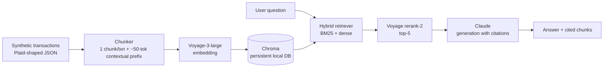

# finance-pipeline-rag

[](https://github.com/HarshPatel7x/finance-pipeline-rag/actions/workflows/eval.yml)

> RAG pipeline over a banking-history corpus — LangChain orchestration + Chroma vector store + Claude API generation. Hybrid retrieval (BM25 + dense embedding) following the Anthropic Contextual Retrieval pattern, with reranking and a DeepEval CI eval suite.

> **Corpus note:** the project ships with a **synthetic corpus** of ~500-1000 transactions, deterministically generated to exercise retrieval quality across 15-20 categories and 12 months. This is honest about scope — the predecessor [`finance-pipeline`](https://github.com/HarshPatel7x/finance-pipeline) ingests Plaid-sandbox data; real BofA `development`-mode OAuth was a known unresolved blocker. The retrieval + eval logic is corpus-agnostic — swap in real DynamoDB output once available without changing the pipeline.

> **Status:** Steps 1–7 shipped (skeleton → synthetic corpus → Chroma index → hybrid retrieval → grounded generation → DeepEval eval harness → CI gate). Eval suite + GitHub Actions gate are live. Per-step build notes are in [`notes/`](./notes/).

---

## What this project defends (resume-verbatim claims)

This repo exists to be the working proof behind these lines on the AI resume — any of which a recruiter or screener may probe:

- **RAG pipeline over banking-history corpus:** LangChain orchestration + Chroma vector store + Claude API generation.
- **Hybrid retrieval** (BM25 keyword filter + dense semantic embedding) following the **Anthropic Contextual Retrieval** pattern — chunk-level contextual prefix added before embedding, then reranking on top-k candidates.
- **DeepEval test suite** — faithfulness, answer-relevancy, contextual-recall, and hallucination-rate metrics (DeepEval RAG-triad) — running on every pipeline-touching pull request via GitHub Actions CI/CD.
- **Targets:** hallucination rate <5%, faithfulness >0.85, contextual-recall@5 >0.85, p95 retrieval latency <200 ms.
- **Reusable eval harness** pluggable into downstream agent + MCP projects.

---

## Architecture


```mermaid
flowchart LR
    A[Synthetic transactions<br/>Plaid-shaped JSON] --> B[Chunker<br/>1 chunk/txn + ~50-tok contextual prefix]
    B --> C[Voyage-3-large<br/>embedding]
    C --> D[(Chroma<br/>persistent local DB)]
    Q[User question] --> E[Hybrid retriever<br/>BM25 + dense]
    D --> E
    E --> F[Voyage rerank-2<br/>top-5]
    F --> G[Claude<br/>generation with citations]
    G --> H[Answer + cited chunks]
```

The pipeline embeds each transaction chunk with a contextual prefix (per Anthropic's [Contextual Retrieval](https://www.anthropic.com/news/contextual-retrieval) pattern, 2024) so retrieval sees "context + content," not just content. At query time, BM25 catches exact merchant matches that dense retrieval misses; dense catches semantic matches BM25 misses; the union is reranked by Voyage rerank-2 and fed to Claude for citation-grounded generation.

---

## Metrics

Measured by the Step-6 DeepEval RAG-triad over a 20-question golden set, **strong judge** (OpenRouter Llama-3.3-70B):

| Metric | Target | Measured (strong judge) | Note |
|---|---|---|---|
| Faithfulness | >0.85 | **0.948 ✅** | weak local-8B judge scored 0.593 — see judge-dependence below |
| Answer relevancy | >0.85 | **0.906 ✅** | weak 8B: 0.671 |
| Contextual recall @ 5 | >0.85 | **1.000 ✅** (8 exact-fact) | aggregates excluded — a computed total isn't verbatim in any chunk; weak 8B: 0.700 |
| Trick-question refusals | grounding guard | **4/4 ✅** | judge-independent (exact refusal-match) |
| p95 retrieval latency | <200 ms | **470 ms** ❌ (p50 405, n=40) | two Voyage network round-trips (embed + rerank) dominate; a co-located or local reranker would close the gap |

**Judge-dependence (key finding).** The numbers above come from a strong judge. A controlled A/B (`eval/compare_judges.py`) over the *identical* 20 cases with a weak local-8B judge scored the **same system** 0.593 / 0.671 / 0.700 — failing all three — because the weak judge mis-scores (e.g. 0.0 faithfulness on a correct answer). An 0.85 gate is only trustworthy with a capable judge: locally the eval grades with a **Groq-first → local-Ollama-fallback** 70B chain, and **CI** uses a strong cloud judge (**OpenRouter** 70B — Ollama isn't available on GitHub runners). Full detail: `notes/step-06-eval-harness.md` Finding 5.

**Honesty rule:** metrics are reported as actually measured, with the judge noted. No silent fudging — the weak-judge numbers are shown right beside the strong-judge ones.

---

## Stack + decisions

| Layer | Tool | Why this choice |
|---|---|---|
| Orchestration | LangChain | Standard RAG plumbing; matches AI-stack expectations |
| Embedding | Voyage-3-large | Anthropic-aligned embedding model; ~$1 to embed full corpus |
| Vector store | Chroma | Local persistent DB; appropriate for <10K-doc corpus, no infra cost |
| Reranker | Voyage rerank-2 | Same vendor as embed → single API integration; typically >5pp recall lift |
| Generation | Claude (Haiku dev / Sonnet eval) | Haiku for fast iteration; Sonnet for eval runs that need higher fidelity |
| Eval framework | DeepEval | RAG-triad metrics (faithfulness, recall, relevancy); industry-standard |
| Eval judge LLM | Resilient 70B chain — local: Groq → Ollama fallback; CI: OpenRouter (no Ollama on runners) | A strong judge gates honestly (a weak 8B lowballs a good system — see eval Finding 5); local Ollama is the free/offline fallback |
| CI | GitHub Actions (`.github/workflows/eval.yml`) | Eval runs on PRs touching the pipeline; merge gated on the triad thresholds (`run_eval` exits non-zero on fail) |

Key decisions are summarized in the table above; per-step rationale lives in [`notes/`](./notes/).

---

## How to run (local)

**Prerequisites:** Python 3.10+, [Ollama](https://ollama.ai/download) installed locally.

```bash
# 1. Clone + create virtual environment
git clone https://github.com/HarshPatel7x/finance-pipeline-rag
cd finance-pipeline-rag
python -m venv venv && source venv/bin/activate
pip install -r requirements.txt

# 2. Configure API keys
cp .env.example .env
# Edit .env: VOYAGE_API_KEY + ANTHROPIC_API_KEY (required for retrieval + generation).
# For the eval suite (step 8): GROQ_API_KEY (default judge, free tier) — or set
#   JUDGE_CHAIN=ollama/llama3.1 to grade fully locally with no cloud judge key.
# Optional: OPENROUTER_API_KEY — used by the judge A/B (eval/compare_judges.py) and CI.

# 3. Start the local judge LLM (one-time pull, then daemon)
ollama pull llama3.1:8b
ollama serve  # leave running in a separate terminal

# 4. Generate the synthetic corpus + build the vector index
python scripts/generate_corpus.py   # 693 transactions → data/transactions.json
python scripts/build_corpus.py      # → data/corpus.json (chunked with Contextual prefix)
python scripts/build_index.py       # → chroma_db/ (Voyage embeddings, persisted)

# 5. (Optional) Verify hybrid retrieval — prints top-5 chunks for a sample query
python scripts/retrieve.py "Vietnamese food in summer 2025"

# 6. Ask a question (full RAG: retrieve → ground on Claude → cite chunks)
python scripts/ask.py "How much did I spend on dining in Q1?"

# 7. Run the unit tests
pytest tests/

# 8. Run the eval suite (DeepEval RAG-triad on the 20-question golden set)
#    Needs the index (step 4) + ANTHROPIC/VOYAGE keys + a judge key (step 2),
#    or JUDGE_CHAIN=ollama/llama3.1 to grade fully locally.
python -m eval.run_eval
```

---

## Citation

Implements the **Anthropic Contextual Retrieval** pattern (Sept 2024) — chunk-level contextual prefix added before embedding + BM25 keyword filter + dense semantic retrieval + Voyage rerank on top-k.

📄 <https://www.anthropic.com/news/contextual-retrieval>

---

## Learning notes

Each build step has a retrospective notes file in [`notes/`](./notes/) — concepts taught, decisions made, gotchas hit, snippets worth remembering. Compiled at the close of each step, beginner-friendly language.

---

*Pair-engineered with [Claude Code](https://claude.com/claude-code) (Opus 4.7) via the `/vasudev` Apply pipeline.*
