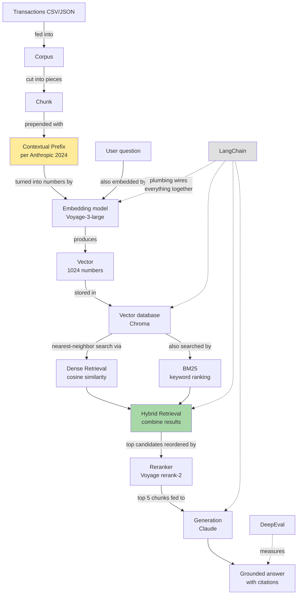

# Glossary — Concept map for the RAG pipeline

Read top-to-bottom for the whole picture. Or jump straight to any concept and follow the **Depends on** / **Feeds into** links to walk the graph.

---

## The big picture (one diagram)

Yellow = the Anthropic Contextual Retrieval addition that makes this project's setup distinctive. Green = the hybrid step. Grey = infrastructure that wires it together. Everything else is the data path.

---

## The ordered walk (top → bottom = reading order)

The pipeline is built in steps; the glossary follows the same direction. Start at **RAG** if you want the punchline, or **Corpus** if you want the data-path-first view.

| # | Concept | One-line |
|---|---|---|
| 1 | [RAG](#1-rag-retrieval-augmented-generation) | The whole pattern — what we're building. |
| 2 | [Corpus](#2-corpus) | The body of text being searched. |
| 3 | [Chunk](#3-chunk) | A single searchable unit; one chunk = one transaction here. |
| 4 | [Contextual prefix](#4-contextual-prefix-anthropic-sept-2024) | A small tag prepended to each chunk that makes it more findable. |
| 5 | [Embedding](#5-embedding) | Turning text into a list of numbers (a vector). |
| 6 | [Vector](#6-vector) | The list of numbers itself; the math representation. |
| 7 | [Cosine similarity](#7-cosine-similarity) | How "close" two vectors are = how similar in meaning. |
| 8 | [Vector database (Chroma)](#8-vector-database-chroma) | Where the vectors live so we can search them fast. |
| 9 | [Dense retrieval](#9-dense-retrieval) | Searching by meaning, using vectors + cosine similarity. |
| 10 | [BM25](#10-bm25) | Searching by exact keywords; the non-AI side of search. |
| 11 | [Hybrid retrieval](#11-hybrid-retrieval) | Run dense + BM25 together, combine results. |
| 12 | [Reranking](#12-reranking) | A second-pass sort to refine the top candidates. |
| 13 | [Generation](#13-generation) | The LLM (Claude) writes the final answer using retrieved chunks. |
| 14 | [Faithfulness, hallucination, contextual recall](#14-eval-metrics-faithfulness--hallucination--contextual-recall) | The four numbers the eval suite reports. |
| 15 | [LangChain](#15-langchain) | The plumbing that wires every box above together. |
| 16 | [.gitignore / requirements.txt / .env / .env.example](#16-project-hygiene--gitignore--requirementstxt--env--envexample) | Project hygiene basics. |

---

## 1. RAG (Retrieval-Augmented Generation)

**What:** The whole pattern this project implements. Two-step: **retrieval** finds relevant pieces of your data, **generation** has an LLM write the answer using them.

**Where in pipeline:** The umbrella name for the whole flow.

**Depends on:** [Corpus](#2-corpus), [Embedding](#5-embedding), [Vector database](#8-vector-database-chroma), [Hybrid retrieval](#11-hybrid-retrieval), [Generation](#13-generation)

**Why it exists:** LLMs don't know your private data, have knowledge cutoffs, and stuffing everything into the prompt is slow + expensive. RAG sends only the most relevant 5-10 chunks per question.

**In our project:** the four resume claims (faithfulness >0.85, hallucination <5%, contextual-recall@5 >0.85, p95 latency <200ms) are all measuring RAG quality.

---

## 2. Corpus

**What:** Latin for "body" — the AI/NLP word for "the collection of text we're going to search over."

**Where in pipeline:** The raw input. Everything starts here.

**Depends on:** nothing.

**Feeds into:** [Chunk](#3-chunk).

**In our project:** 693 synthetic transactions in `data/transactions.json`. Generated by `scripts/generate_corpus.py` with deterministic seed=42.

---

## 3. Chunk

**What:** A single searchable unit. For text documents, a chunk is usually a ~500-token slice. For transaction data like ours, **one chunk = one transaction**.

**Where in pipeline:** Sits between the raw corpus and the embedding step.

**Depends on:** [Corpus](#2-corpus).

**Feeds into:** [Contextual prefix](#4-contextual-prefix-anthropic-sept-2024), then [Embedding](#5-embedding).

**In our project:** each chunk is `{id, text, metadata}`. The `text` is what gets embedded; `metadata` is structured fields (date, merchant, amount) used for filtering + citation display.

---

## 4. Contextual prefix (Anthropic, Sept 2024)

**What:** A short (~50-token) tag prepended to each chunk **before** embedding. The prefix surfaces context that's not literally in the chunk's words.

**Where in pipeline:** Lives between the chunk and the embedding step. It's the Anthropic-pattern addition that distinguishes this project from a vanilla RAG.

**Depends on:** [Chunk](#3-chunk).

**Feeds into:** [Embedding](#5-embedding) — the prefix + the original record together get embedded.

**Why it helps:**
- Bare chunk: `"Saigon Noodle House $15.87 2025-06-03"` — short, no context tags.
- With prefix: `"Dining out transaction from June 2025 (summer). Restaurant spend, $15.87. | 2025-06-03 — Saigon Noodle House — $15.87 — dining out"` — now "dining," "June 2025," "summer" all sit directly in the embedded text.

When a user asks "Vietnamese food in summer 2025?", the embedded prefix makes the chunk findable by *concept* even though the bare record doesn't contain those words. Anthropic's published benchmark: **+49% improvement** in retrieval failure rate when combined with [BM25](#10-bm25) + [reranking](#12-reranking).

**Important:** the prefix is for the **search index ONLY**. At generation time, Claude sees only the original record line (so the answer cites the real data, not a synthetic description).

**In our project:** `src/prefix.py::make_prefix(transaction)` — written by you in Step 2.7.

---

## 5. Embedding

**What:** Turning text into a list of numbers (a [vector](#6-vector)) so a computer can measure how similar two texts are.

**Where in pipeline:** Converts each [chunk's text + prefix](#4-contextual-prefix-anthropic-sept-2024) into a vector, which gets stored in the [vector database](#8-vector-database-chroma).

**Depends on:** [Chunk](#3-chunk), [Contextual prefix](#4-contextual-prefix-anthropic-sept-2024).

**Feeds into:** [Vector](#6-vector), [Vector database](#8-vector-database-chroma).

**How it works:**
- Voyage-3-large is a neural network trained on billions of text pairs labeled "similar" or "different."
- During training it learned: similar pairs → close-together vectors; different pairs → far-apart vectors.
- After training, you feed any text in → get a 1024-number vector out.

**In our project:** Voyage-3-large is the embedding model (locked in `DECISIONS.md` row 1). Step 3 will embed each of the 693 chunks. Cost ~$1 total via Voyage's API.

---

## 6. Vector

**What:** The list of numbers an embedding produces. For Voyage-3-large, every vector is exactly 1024 numbers long.

**Where in pipeline:** Output of [embedding](#5-embedding), input to the [vector database](#8-vector-database-chroma).

**Depends on:** [Embedding](#5-embedding).

**Feeds into:** [Vector database](#8-vector-database-chroma), [Cosine similarity](#7-cosine-similarity).

**Mental model:** a vector is a *coordinate* in a 1024-dimensional space. The numbers themselves don't mean anything human-readable — only the *relative positions* of vectors matter. Two vectors close in space = two texts close in meaning.

**In our project:** 693 vectors stored in Chroma. Each one represents one transaction (prefix + record).

---

## 7. Cosine similarity

**What:** The "closeness" measure between two [vectors](#6-vector). Outputs a number between **-1 and 1** (in practice for embeddings, 0 to 1). Higher = more similar in meaning.

**Where in pipeline:** Used at query time by [dense retrieval](#9-dense-retrieval) to find chunks closest to the question.

**Depends on:** [Vector](#6-vector).

**Feeds into:** [Dense retrieval](#9-dense-retrieval).

**Plain-English math:** technically the cosine of the angle between two vectors. You don't need to compute it — Chroma does it for you. Just know:
- **0.95** = very close meaning (e.g. "Vietnamese restaurant" ↔ "Pho place")
- **0.50** = vaguely related (e.g. "Vietnamese restaurant" ↔ "Asian grocery store")
- **0.10** = unrelated (e.g. "Vietnamese restaurant" ↔ "auto repair shop")

---

## 8. Vector database (Chroma)

**What:** A database optimized for storing [vectors](#6-vector) and doing fast nearest-neighbor lookups via [cosine similarity](#7-cosine-similarity).

**Where in pipeline:** The storage layer between embedding (at index time) and retrieval (at query time).

**Depends on:** [Embedding](#5-embedding), [Vector](#6-vector).

**Feeds into:** [Dense retrieval](#9-dense-retrieval).

**Why we picked Chroma** (locked in `DECISIONS.md` row 3): local, file-based persistence (no separate server to run), free, perfect for corpora under ~10K documents. Alternative was Pinecone (cloud, paid) — overkill for portfolio scope.

**In our project:** Step 3 will create a Chroma store at `chroma_db/` (which is in `.gitignore` — it gets rebuilt from `corpus.json` on demand).

---

## 9. Dense retrieval

**What:** Searching by **meaning** — embed the question, ask the vector database for the N chunks whose vectors are closest (highest [cosine similarity](#7-cosine-similarity)).

**Where in pipeline:** One of two retrievers in the [hybrid retrieval](#11-hybrid-retrieval) step. The "AI-flavored" half.

**Depends on:** [Embedding](#5-embedding) (to embed the question), [Vector database](#8-vector-database-chroma), [Cosine similarity](#7-cosine-similarity).

**Feeds into:** [Hybrid retrieval](#11-hybrid-retrieval).

**Strength:** matches by *concept* even when exact words differ. "Vietnamese food" finds Saigon Noodle House.

**Weakness:** occasionally fooled. "I love this product" and "I hate this product" have suspiciously close vectors because *product* dominates over sentiment. That's why we still need [BM25](#10-bm25).

---

## 10. BM25

**What:** A 1994 keyword-ranking algorithm. Smart Ctrl+F that ranks documents best-match-first. **No AI involved** — just a math formula on word counts.

**Where in pipeline:** The other retriever in [hybrid retrieval](#11-hybrid-retrieval). The "old-school" half.

**Depends on:** [Chunk](#3-chunk).

**Feeds into:** [Hybrid retrieval](#11-hybrid-retrieval).

**Three rules:**
1. **More occurrences = higher rank.**
2. **Rare words count more.** "the" appears everywhere → ignored. "saigon" rare → weighted heavily.
3. **Long documents penalized slightly** so they don't win every search just by containing every word.

**Strength:** exact-string matches. "Saigon Noodle House" → finds it letter-for-letter even when [embeddings](#5-embedding) get fuzzy.

**Weakness:** zero idea about meaning. "Vietnamese food" won't find Saigon Noodle House if the chunk doesn't literally contain the word "Vietnamese."

**In our project:** the `rank-bm25` Python package (in `requirements.txt`).

---

## 11. Hybrid retrieval

**What:** Run [dense retrieval](#9-dense-retrieval) AND [BM25](#10-bm25) **at the same time**, combine the candidate lists, dedupe. Anthropic's pattern recommends taking the union and then [reranking](#12-reranking).

**Where in pipeline:** Sits between the question and the [reranker](#12-reranking). Produces ~50 candidate chunks per question.

**Depends on:** [Dense retrieval](#9-dense-retrieval), [BM25](#10-bm25).

**Feeds into:** [Reranking](#12-reranking).

**Why combine:** the two methods catch different question shapes —
- **"Vietnamese food in June"** → dense wins (semantic match)
- **"Did I go to Saigon Noodle House?"** → BM25 wins (exact-string match)

Combined, both shapes land.

---

## 12. Reranking

**What:** A second-pass sort on the ~50 candidates from [hybrid retrieval](#11-hybrid-retrieval), using a more accurate (but slower) model. Output: top 5-10 chunks.

**Where in pipeline:** Last step before [generation](#13-generation).

**Depends on:** [Hybrid retrieval](#11-hybrid-retrieval).

**Feeds into:** [Generation](#13-generation).

**Why a second sort:** [embedding](#5-embedding) is fast but coarse; reranking is slow but precise. Two-stage = fast first cut + precise final ranking. Reranking ~50 chunks is cheap; reranking the entire 693-chunk corpus would be expensive.

**In our project:** Voyage rerank-2 (`DECISIONS.md` row 3). Same vendor as embedding → one API integration. Typical recall lift: 5+ percentage points.

---

## 13. Generation

**What:** The final step — the LLM (Claude) reads the top reranked chunks + the user's question and writes a grounded answer with citations.

**Where in pipeline:** The output stage.

**Depends on:** [Reranking](#12-reranking).

**Feeds into:** the user's answer.

**Why "grounded":** the answer must be supported by the retrieved chunks. If Claude says "$487 on dining," it should cite specifically which transactions add up to that. Citations are how the eval ([faithfulness, hallucination](#14-eval-metrics-faithfulness--hallucination--contextual-recall)) is measured.

**In our project:** Claude Haiku for fast dev iteration, Claude Sonnet for eval runs that need higher fidelity (`DECISIONS.md` row 2). Both via the Anthropic API — covered by your Claude Max 5x subscription? No — Max gives access to the chat product; API calls are billed separately under the same API key.

---

## 14. Eval metrics: faithfulness / hallucination / contextual recall

**What:** The four numbers DeepEval reports per question. Each one measures a different RAG failure mode.

**Where in pipeline:** Measured *after* [generation](#13-generation), against the 20 golden Q&A.

**Depends on:** [Generation](#13-generation).

**Feeds into:** the CI gate (`faithfulness > 0.85` blocks merges).

**The four metrics:**
| Metric | What it measures | Target |
|---|---|---|
| **Faithfulness** | Does the answer actually follow from the retrieved chunks? Or did the LLM make stuff up? | > 0.85 |
| **Hallucination rate** | Inverse of faithfulness — how often the answer contains content not in the chunks. | < 5% |
| **Contextual recall @ 5** | Did the top-5 retrieved chunks contain the right answer? Tests the [retrieval](#11-hybrid-retrieval) half, not the generation half. | > 0.85 |
| **p95 retrieval latency** | 95th-percentile time for a query to return its top-5 chunks. | < 200 ms |

The first three are scored by the **judge LLM** (Ollama Llama-3.1-8B local, per `DECISIONS.md` row 6 — $0/run). p95 is just a timer around `retriever.invoke(question)`.

---

## 15. LangChain

**What:** A **plumbing kit** for AI apps. Provides standard interfaces + connectors so you don't write all the glue between Voyage + Chroma + Claude yourself.

**Where in pipeline:** Wires together [embedding](#5-embedding) → [vector database](#8-vector-database-chroma) → [hybrid retrieval](#11-hybrid-retrieval) → [reranking](#12-reranking) → [generation](#13-generation).

**Depends on:** nothing in our pipeline conceptually — it's infrastructure.

**Feeds into:** every step above.

**Analogy:** LEGO Technic for AI. You bring the bricks (Voyage, Chroma, Claude); LangChain brings the standardized pegs that snap them together. Without it, ~100 lines of glue per project. With it, ~20 lines.

**Tradeoff:** LangChain has lots of layers and APIs change often. Some teams ditch it for direct API calls when they want stability. For a portfolio project, "LangChain" on the resume signals you know the standard tooling.

---

## 16. Project hygiene — `.gitignore` / `requirements.txt` / `.env` / `.env.example`

**What:** Four files every Python project should have. Not part of the RAG pipeline itself, but make the repo runnable + safe.

| File | What it is | In `.gitignore`? | Why |
|---|---|---|---|
| `.gitignore` | Tells git which files to skip | itself: NO | The "skip list" — venv, caches, secrets, vector DB |
| `requirements.txt` | Recipe list of Python packages | NO | Tiny; anyone cloning needs it to `pip install` |
| `.env` | Your secret API keys (Voyage, Anthropic) | **YES** | If committed, anyone can read your keys forever |
| `.env.example` | Public template with key *names* only | NO | Tells anyone cloning what env vars to fill in |

**Rule:** the recipe is in git, the installed library box is not. The template is in git, the secret file is not.

If you ever accidentally commit a `.env`, **rotate the keys immediately** — once in git history, they're public forever (even if you delete the file in a later commit).

---

## How to use this glossary

- **First time read:** go top-to-bottom. Concepts are ordered so each one builds on the previous.
- **Came back to look something up:** click a heading from the table, follow the **Depends on** / **Feeds into** links to refresh the surrounding context.
- **Building a step:** read the concept for that step + everything it depends on. E.g. for Step 3 (embedding), read sections 5-8.
- **Explaining the project to someone else:** the mermaid diagram at the top is the elevator pitch. Each box on the diagram is a heading in this file.
